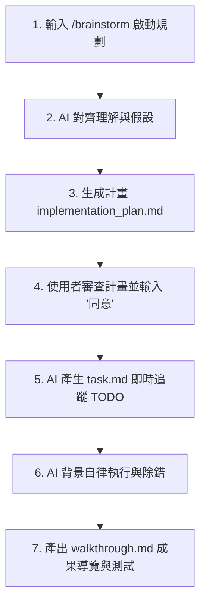

# MAT 團隊專屬：Antigravity 快速參考指南與工作流清單

> [!NOTE]
> 本指南為 MAT 同事提供 **Antigravity** 的核心指令、自訂技能以及標準工作流的快速檢索清單。
> 建議將此檔案複製分發給同仁，作為日常協作的「小抄 (Cheat Sheet)」。

---

## 🚀 第一部分：Antigravity 原生斜線指令 (Slash Commands)

這五個是 Antigravity 核心引擎內建的斜線指令。**開箱即用，不需要額外分享任何 Skill 檔案**：

| 指令 | 核心功能 | 適用開發情境 |
| :--- | :--- | :--- |
| **`/goal`** | **終極任務長跑模式** | 當需要執行複雜、涉及多重步驟、或希望跑一整夜自動化測試與除錯的長任務時啟動。AI 將發揮極致耐心，不達目標絕不罷休。 |
| **`/browser`** | **實時網頁瀏覽檢索** | 當需要查閱最新推出的技術文檔、官方 API 手冊或遇到極難排除的 Bug 時，引導 AI 啟動此功能上網搜尋，告別過時資訊。 |
| **`/grill-me`** | **引導式面試對齊** | 當您只有模糊的想法、不知從何開始規劃時啟動。AI 會以面試官身份向您提問，透過一問一答快速收斂並形成具體方案。 |
| **`/schedule`** | **背景計時與 Cron 排程** | 用於建立一次性計時器或設定標準 cron 定時排程。例如每 5 分鐘自動在背景檢查一次伺服器健康狀況並主動回報。 |
| **`/brainstorm`** | **自訂需求對齊與規劃** | 啟動我們為您特別擴充的 `brainstorm` 技能（詳細見第二部分），強制在動手寫 Code 前與您對齊理解並產出計劃書。 |

---

## 🛠️ 第二部分：自訂擴充技能 (Custom Skills) 清單

這兩項是特別為 MAT 團隊設計與擴充的自訂技能，**已備份在專案的 `skills/` 目錄中**，同仁需複製到 `C:\Users\<Username>\.gemini\config\skills\` 目錄下方可生效：

### 1. `/brainstorm` ── 動手前先想清楚 (引言式規劃)
*   **功能**：在開發前釐清「到底要做什麼」，預防功能無限膨脹 (YAGNI 原則)。
*   **自適應溝通模式**：
    *   **🟢 小白模式**：完全過濾技術名詞，大白話探討「你會得到什麼成果」與「潛在風險」，非技術同仁的最愛。
    *   **🔴 工程師模式**：高密度技術詞彙（API、套件、檔名），以最精簡的術語極速對齊。
*   **輸出成果**：在 `plans/` 下自動生成結構化的 Markdown 實作計劃書，並在使用者確認「同意」後才開始動手。

### 2. `workflow-skill-creator` ── 打造團隊自動化工具庫 (經驗複用)
*   **功能**：將成功的對話工作流自動「打包」成可重複執行的 Skill。
*   **生成的 Skill 特色**：
    *   自動實作 **Rate Limiting**（流量限制退避），呼叫 API 不怕被封鎖。
    *   自動實作 **File-lock**（進程鎖），安全防範多 AI Agent 同時寫入衝突。
    *   **File Output** 輸出模式：結果全部寫入檔案，確保 Token 效率，避免終端機資訊爆載。

---

## 🔄 第三部分：MAT 核心工作流 (Core Workflows) 標準作業程序

### 🔄 工作流 A：Vibe Coding 標準開發流程 (先規劃、後動手)

這套流程能確保 AI 與您的理解 100% 對齊，產出最高品質的代碼：



1.  **啟動規劃**：輸入 `/brainstorm [主題]`。
2.  **假設先行**：AI 列出 3-5 個對需求的理解假設，與您對齊。
3.  **生成計畫**：AI 撰寫詳細技術實作計畫 `GEMINI.md` / `implementation_plan.md`。
4.  **核准計畫**：使用者輸入 **「同意」**。
5.  **任務追蹤**：AI 生成 `task.md`，以 `[ ]`、`[/]`、`[x]` 即時呈現進度。
6.  **自律執行**：AI 自動建立虛擬環境、下載套件、編寫代碼並自動 debug。
7.  **交付驗證**：產出 `walkthrough.md` 變更導覽，提供圖表與測試結果。

---

### 🔄 工作流 B：專案環境防污染流程 (堅持使用 uv)

嚴格隔離不同分析專案的套件依賴，保護電腦 Base 環境的極致乾淨：

1.  **專案初始化**：
    ```powershell
    uv init my-project
    cd my-project
    ```
2.  **新增套件依賴 (自動更新 pyproject.toml 與 uv.lock)**：
    ```powershell
    uv add pandas openpyxl
    ```
3.  **程式碼隱式執行 (免激活、免 activate)**：
    ```powershell
    uv run main.py
    ```

---

### 🔄 工作流 C：GitHub 遠端自動化版本控管流程

首個版本自動建立 GitHub 儲存庫上傳，重大功能變更自動分支防禦：

1.  **本地初始化與首版 Commit**：
    使用台灣繁體中文撰寫 Commit message。
    ```powershell
    git init
    git branch -M main
    git add .
    git commit -m "feat: 初始化分析工具"
    ```
2.  **gh CLI 遠端託管與代碼推送**：
    ```powershell
    gh repo create [專案名稱] --public --source=. --push
    ```
3.  **分支防禦策略**：
    重大異動時，AI 自動建立 Branch 開發，測試無誤後再詢問使用者是否 `merge` 回 `main` 主分支。
